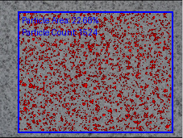

# Dark Particle Analyzer - 深色粒子分析器

🚀🚀🚀

本程序是一款用于自动识别、标记和统计图像中深色粒子的分析工具。它能适应不均匀的光照，并允许用户通过调整灵-敏度范围和粒子大小等参数，实现精准分析。

---

## ✨ 功能特性

- **局部自适应阈值**：不受光照不均的影响，精准识别粒子。
- **灵敏度范围调节**：可设定一个灵敏度区间（最小值和最大值），只识别在此范围内的粒子。
- **粒子大小筛选**：可以过滤掉过小或过大的粒子，只关注特定尺寸范围内的目标。
- **选区处理**：支持框选图像中的特定区域进行分析。
- **批量处理**：可一次性处理多张图片，并将结果保存到指定目录。
- **双主题界面**：提供深色和浅色两种现代化UI主题。

---

## 🚀 使用说明

### 1. 加载图像

点击 **"Load Image"** 按钮，选择一张要分析的图片（支持 `.png`, `.jpg`, `.bmp` 格式）。

### 2. 选择分析区域

- **全图分析**：加载图像后，直接调整参数即可对全图进行分析（默认）。
- **局部区域分析**：在左侧的原始图像上，按住鼠标左键拖拽，可以框选一个矩形区域。松开鼠标后，程序将自动对该区域进行处理。

### 3. 调整参数

> 每次调整参数后，如果已存在选区，程序会自动重新处理并更新结果。

#### 处理参数 (`Processing Parameters`)

| 参数                                   | 说明                                                                       |
| :------------------------------------- | :------------------------------------------------------------------------- |
| **Sensitivity Min (灵敏度下限)** | 识别标准的最严格阈值。只有暗度**大于**此标准的粒子才会被考虑。       |
| **Sensitivity Max (灵敏度上限)** | 识别标准的最宽松阈值。只有暗度**小于**此标准的粒子才会被考虑。       |
| **Blur Radius (模糊半径)**       | 用于计算背景亮度的模糊半径。此值应**大于**您想识别的最大粒子的半径。 |
| **Border Width (边框宽度)**      | 在分析区域内忽略的边框宽度（像素）。                                       |

#### 粒子大小筛选 (`Particle Size Filter`)

| 参数                                       | 说明                                                              |
| :----------------------------------------- | :---------------------------------------------------------------- |
| **Min Particle Size (最小粒子面积)** | 过滤掉面积小于此值的粒子（单位：像素）。                          |
| **Max Particle Size (最大粒子面积)** | 过滤掉面积大于此值的粒子（单位：像素）。设置为 `0` 则不设上限。 |

### 4. 查看结果

- **右侧图像**: 显示标记后的结果图，被识别的粒子会用红色高亮标出。
- **底部状态栏**: 显示识别出的粒子占选区总面积的百分比，以及粒子的总数量。

### 5. 保存与清除

- **Save Result**: 点击可将右侧标记后的结果图保存为文件。
- **Clear Selection**: 清除当前的选区和分析结果，恢复到未选区的状态。

### 6. 批量处理

1. 在 **"Batch Processing"** 区域，通过 **"Browse..."** 按钮选择一个用于存放结果的输出文件夹。
2. 点击 **"Batch Process"** 按钮，选择多张图片。
3. 程序将使用当前界面上设定的参数，对所有选中的图片进行全图分析，并将结果一一保存到指定的输出文件夹中。
